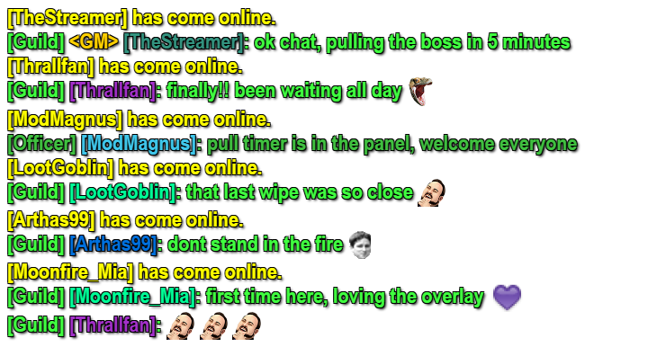

# Twitch Chat → WoW Guild Chat Overlay

A single-file OBS Browser Source that shows your live Twitch chat styled like World of Warcraft guild chat. No install, no libraries, no Twitch login or app registration.



## Features

- Anonymous connection to Twitch chat (`justinfan` user), with automatic reconnect and PING/PONG handling
- `[Guild] [Name]: message` formatting in guild green (`#40FF40`)
- Moderators appear as `[Officer]` (`#40C040`); the broadcaster appears as `[Guild] <GM>`
- Usernames get a WoW class color, chosen by hashing the username so each person always keeps the same color
- Twitch emotes rendered inline
- Yellow `[Name] has come online.` line the first time someone chats in a session
- Messages stack from the bottom, keep a maximum number of lines, and fade out after a set time
- Message text is inserted as plain text, so chat can't inject HTML
- Ignores common bots (configurable)
- Messages deleted by a moderator disappear from the overlay, and a timed-out or banned user's messages are removed. Messages held by AutoMod never reach chat, so they never appear
- Transparent background with a dark text outline so it reads over any game
- Test mode with fake chatters

## Setup

1. **Download** `ttvguildchat.html` and save it somewhere permanent, e.g. `C:\Overlays\`. OBS reads it from that location every time, so don't move it afterwards.
2. **Set your channel.** Open the file in a text editor and change the channel in the `CONFIG` block near the top:
   ```js
   channel: "yourchannel",
   ```
   Use your Twitch channel name (the login name, not a display name with special characters). Alternatively, leave the file alone and append `?channel=yourname` to the URL (see [URL parameters](#url-parameters)).
3. **Add it to OBS.**
   - In **Sources**, click **+** and choose **Browser**.
   - Tick **Local file** and browse to `ttvguildchat.html`.
   - Set **Width** `600` and **Height** `450` (fits 12 lines at 24px; adjust to taste).
   - Clear the **Custom CSS** box. OBS fills it with a default background style.
4. **Position it.** Drag the source where you want it. New messages appear at the bottom edge and push older ones up.

## Previewing without live chat

Add `?test=1` to the URL. This generates fake messages from regular users, a moderator and the broadcaster every couple of seconds, so you can position and style the overlay.

OBS's **Local file** option can't take URL parameters. To preview, untick **Local file** and paste a URL into the URL box:

```
file:///C:/Overlays/ttvguildchat.html?test=1
```

Adjust the path to where you saved the file. Switch back to **Local file** when you're done.

## URL parameters

| Parameter | Example | Effect |
|---|---|---|
| `channel` | `?channel=somestreamer` | Overrides the channel set in `CONFIG` |
| `test` | `?test=1` | Fake messages instead of connecting to Twitch |

Combine them with `&`, e.g. `?channel=somestreamer&test=1`.

## Configuration

Everything is in the commented `CONFIG` object at the top of `ttvguildchat.html`:

| Setting | Default | Description |
|---|---|---|
| `channel` | `"yourchannel"` | Twitch channel to read |
| `fontSize` | `24` | Text size in px |
| `fontFamily` | Arial Narrow + fallbacks | CSS font stack |
| `maxLines` | `12` | Lines kept on screen; the oldest is removed first |
| `fadeSeconds` | `30` | Seconds before a line fades out (plus a 1 second fade). `0` = never fade; lines then only leave when `maxLines` is exceeded |
| `ignoredUsers` | `nightbot, streamelements, streamlabs, spotchbot` | Lowercase usernames to hide |
| `testIntervalMs` | `2000` | Delay between fake messages in test mode |
| `colors.guild` | `#40FF40` | Guild chat text |
| `colors.officer` | `#40C040` | Officer chat text (moderators) |
| `colors.system` | `#FFFF00` | "has come online" lines |
| `colors.gm` | `#FFD100` | The `<GM>` tag on the broadcaster |
| `colors.classes` | 13 WoW classes | Class colors used for usernames |

### After editing

OBS loads the page once and doesn't watch the file. After changing anything:

1. Save the file.
2. In OBS, select the Browser Source and click **Refresh cache of current page** in its Properties (or right-click the source and choose Refresh).

The overlay reconnects within a few seconds. Lines currently on screen disappear.

## Troubleshooting

- **Nothing appears:** check the channel name for typos, then type something in chat. Use `?test=1` to confirm the overlay itself renders.
- **A bot's messages don't show:** that's the ignore list. Remove the name from `ignoredUsers` to show it. Only exact usernames match, so a bot with a different name won't be filtered.
- **Text is cut off or wraps oddly:** make the source wider or taller, or lower `fontSize`.
- **Chat stops updating:** the overlay reconnects automatically after a drop. If it doesn't, refresh the source.
- **Font looks different:** Arial Narrow isn't installed everywhere. The fallbacks in `fontFamily` apply, and you can set your own.

## How it works

The page opens a WebSocket to `wss://irc-ws.chat.twitch.tv:443`, logs in anonymously as `justinfan<random number>`, requests the `twitch.tv/tags` capability for badges, display names and emote data, and joins the channel. It is read-only: it cannot send chat messages.
